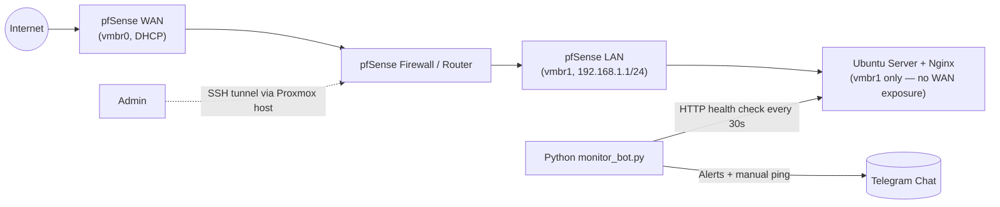

# Nginx Homelab Monitor — Proxmox + pfSense + Telegram Alerting


## Overview

This repository documents a self-built home lab and the monitoring tool that watches it: a **Proxmox VE** hypervisor hosts a **pfSense** firewall that segments the network into WAN/LAN, and an **Ubuntu Server + Nginx** VM sits behind it as the service being protected. A custom **Python + Telegram** bot continuously checks that the web server is reachable, pages a Telegram chat the moment it goes down, and reports back when it recovers — with an inline button for an on-demand manual check at any time.

It was built to get hands-on with virtualization, network segmentation, and infrastructure monitoring end-to-end, and to have something concrete to walk through in interviews.

## Architecture



- **Proxmox VE** — hypervisor (run nested inside VirtualBox with VT-x for this lab build), bridged to the host network.
- **pfSense 2.7.2** — WAN interface on `vmbr0` (DHCP from the upstream network), LAN interface on `vmbr1`, an isolated internal bridge with no physical NIC attached — the web server has no direct path to the outside world except through the firewall.
- **Ubuntu Server + Nginx** — the protected service, attached only to the LAN-side bridge.
- **monitor_bot.py** — polls the server over HTTP, tracks up/down state, and alerts via Telegram; runs independently of the lab itself (e.g., on the Proxmox host or any machine with network access to the LAN).

## Repository structure

```
.
├── .github/workflows/ci.yml   # lint + test on every push/PR
├── tests/test_monitor_bot.py  # unit tests for the alerting logic
├── conftest.py                # makes monitor_bot importable from tests/
├── monitor_bot.py              # the monitoring bot
├── nginx-monitor.service      # systemd unit for running it as a service
├── requirements.txt           # runtime dependencies
├── requirements-dev.txt       # + pytest, flake8, black
├── pyproject.toml             # black config
├── .flake8                    # flake8 config
├── .env.example                # template for required environment variables
├── .gitignore
├── LICENSE
└── README.md
```

## Getting started

### Prerequisites
- Python 3.10+
- A Telegram bot token from [@BotFather](https://t.me/BotFather) and the numeric chat ID you want alerts sent to

### Installation

```bash
git clone https://github.com/azevedtheo/nginx-homelab-monitor.git
cd nginx-homelab-monitor
python3 -m venv venv
source venv/bin/activate
pip install -r requirements.txt
cp .env.example .env      # then edit .env with your real token/chat ID
python monitor_bot.py
```

### Configuration

All configuration is read from environment variables (via `.env`) — nothing is hardcoded in the source:

| Variable                 | Required | Default                  | Description                                  |
|---------------------------|:--------:|---------------------------|-----------------------------------------------|
| `TELEGRAM_BOT_TOKEN`      | yes      | —                          | Bot token from @BotFather                     |
| `TELEGRAM_CHAT_ID`        | yes      | —                          | Chat/user ID to send alerts to                |
| `SERVER_URL`              | no       | `pfSense WAN IPv4 address`    | Endpoint to monitor                           |
| `CHECK_INTERVAL`          | no       | `30`                       | Seconds between health checks                 |
| `ALERT_REPEAT_INTERVAL`   | no       | `60`                       | Seconds between repeated "still down" alerts  |
| `FAILURE_THRESHOLD`       | no       | `2`                        | Consecutive failed checks before alerting     |

### Running as a systemd service

```bash
sudo cp nginx-monitor.service /etc/systemd/system/
sudo systemctl daemon-reload
sudo systemctl enable --now nginx-monitor
sudo systemctl status nginx-monitor
```

## Testing

```bash
pip install -r requirements-dev.txt
pytest -v
```

Tests mock the Telegram bot and HTTP layer, so they run without a real token or a real server — they verify the alerting *logic* (debounce threshold, repeat-alert timing, recovery messages, and that a Telegram API failure never crashes the monitor loop).

## CI/CD

Every push and pull request to `main` runs, via GitHub Actions:
1. `flake8` — lint
2. `black --check` — formatting
3. `pytest` — the test suite

across Python 3.10, 3.11, and 3.12. See [`.github/workflows/ci.yml`](.github/workflows/ci.yml).

## Design notes / lessons learned

- Nested virtualization (Proxmox inside VirtualBox) needed VT-x passthrough enabled explicitly — otherwise VM creation fails silently on CPU type.
- Isolating the LAN bridge (`vmbr1`) with no physical NIC was the key step in actually segmenting the web server from the WAN, rather than just relying on pfSense rules alone.
- The first version of the monitor script alerted on every single failed check; a debounce threshold was added after realizing a single dropped packet shouldn't page anyone.
- The first version could also silently stop monitoring forever if a single Telegram API call failed inside the background thread — now every send is wrapped and logged instead of left to crash the loop.

## Roadmap

- [ ] Monitor multiple endpoints/services from one bot
- [ ] Export metrics to Prometheus / visualize in Grafana
- [ ] TLS on Nginx via Let's Encrypt
- [ ] Provision the lab with Ansible/Terraform instead of manual setup

## License

MIT — see [LICENSE](LICENSE).

## Author

Moises Azevedo — [GitHub](https://github.com/azevedtheo) · [LinkedIn](https://linkedin.com/in/moises-t-azevedo)
